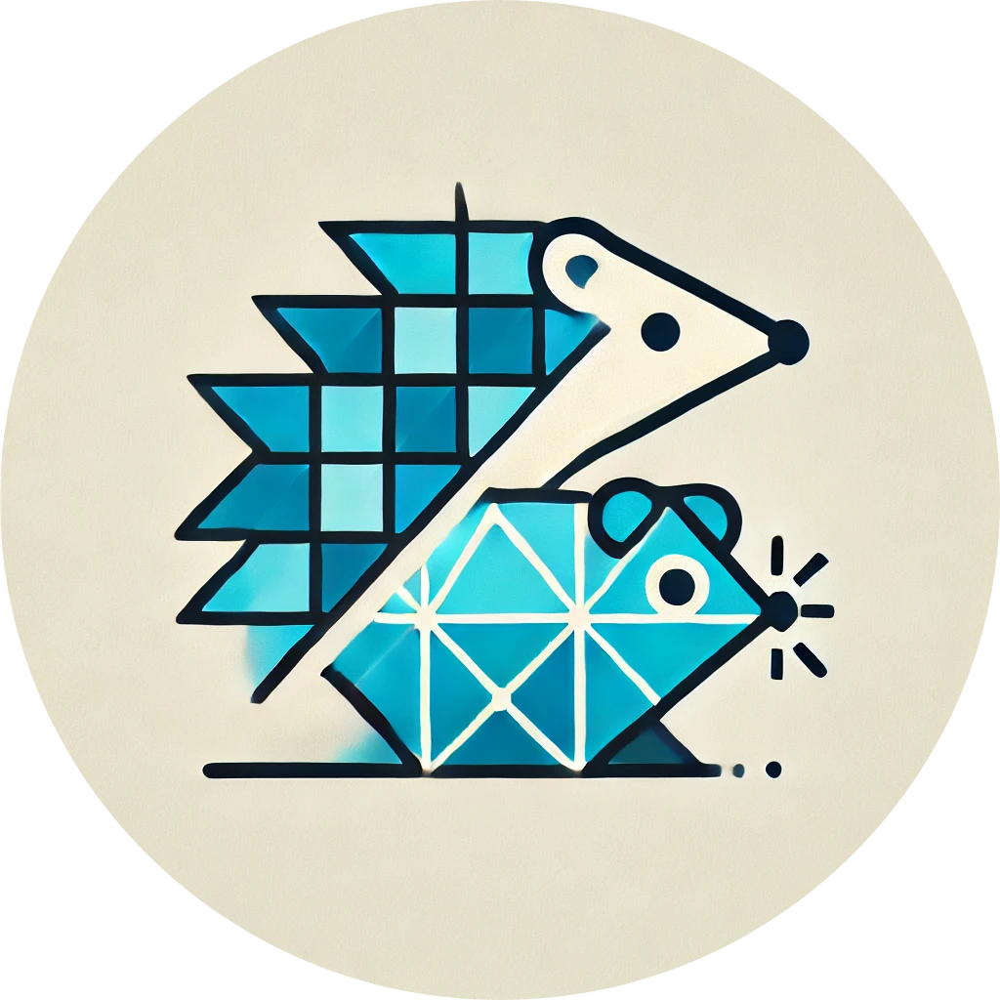

    

<h1 align="center">GoTiGen</h1>

A tool for generating Golang code based on Types, Procedures and Enums defined in ThingsDB.

> [!WARNING]
> This project is very much WIP
> It is very susceptible to change and is missing features
